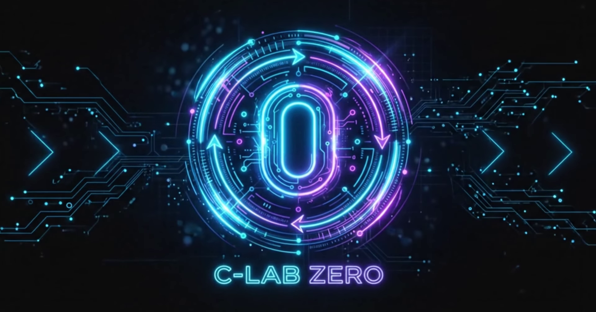

*(Note: On first launch, the app will prompt you to authenticate with your C-LabZero Hub credentials to access the native mesh

# 🚀 C-Lab Zero — The Sovereign AI & Mesh Ecosystem
### Industrial Neon Edition · 4th Generation Federated Agentic Mesh

---

Welcome to the future of decentralized development. **C-Lab Zero** is a sovereign, industrial-grade collaboration platform built specifically for high-security professional teams. 

We didn't just build an app; we built a **three-surface ecosystem** bound together by a post-quantum encrypted P2P mesh, a unified identity model, and a powerhouse AI agent pool. 

## 🌌 The Ecosystem

C-Lab Zero operates across three seamless surfaces:

*   💻 **Desktop App (C-LabMesh):** A high-performance, dark-themed "Industrial Neon" desktop shell built on Flet. It wraps our AI editor and adds P2P collaboration, Post-Quantum Cryptography (PQC), and media calls.
*   🧠 **Source Editor:** A standalone agentic IDE powered by local LLM inference (like Ollama) featuring an 80+ tool autonomous engineering arsenal.
*   🌐 **Website / Hub:** A browser-based management console and Progressive Web App (PWA) that acts as a first-class mesh peer.

---

## 🔥 Killer Features

### 🛡️ Post-Quantum Cryptography (PQC)
We take enterprise-grade security seriously. Every Desktop-to-Desktop session uses a mandatory Hybrid PQC Handshake, combining NIST FIPS 203 (ML-KEM-768) with X25519. All mesh traffic is additionally protected by transport-layer CurveZMQ encryption.

### 🕸️ Federated Agentic Mesh (FAM v3)
Say goodbye to centralized bottlenecks. Our mesh runs as a background daemon enabling seamless P2P collaboration.
*   **Zero-Config Discovery:** Automatically find peers via native network scanning or Hub signaling.
*   **FastCDC Sync:** Ultra-efficient workspace delta-syncing using content-defined chunking.
*   **Multi-Cloud SDN:** Native integration with Tailscale, ZeroTier, NetBird, and more.

### 🤖 Sovereign AI Engine
Your code, your AI. The built-in Source Editor features an autonomous ReAct loop engine.
*   **80+ Tool Arsenal:** From core file operations and TDD engines to DB querying and live web searching.
*   **Local Inference:** Run completely offline using models via Ollama, LM Studio, or vLLM.
*   **Metacognition:** Features advanced reasoning modules like ACT-R Memory and Adversarial Critics.
*   **Path Sentinel:** Strict AI agent lockdown prevents workspace escapes.

### ⚡ Real-Time Collaboration
*   **CRDT Sync:** Conflict-free, simultaneous code editing across the entire mesh.
*   **Encrypted Media Plane:** Secure audio and video calls powered by GStreamer acceleration.

---

## 🛠️ How It Functions

1.  **Host a Workspace:** One user clicks "HOST" to become the central mesh node, binding a secure ZMQ socket and broadcasting the workspace file tree.
2.  **Join the Mesh:** Peers join via a secure URL or local discovery, instantly receiving real-time CRDT updates to the shared workspace.
3.  **Collaborate:** Human peers and AI agents work together. The mesh dynamically monitors a "Mathis Health Score" (MHS) based on network latency, token pressure, and thermal load to ensure absolute stability.

---

## 💻 Platform Support

C-Lab Zero is designed for cross-platform, industrial-grade performance. Both the **Source Editor** and the full **C-LabMesh Desktop App** target the following systems:

*   **Windows (10/11):** 🟢 Fully Supported (Primary Target)
*   **Linux / Ubuntu:** 🟢 Supported (DEB packages available)
*   **macOS:** 🟡 On the Roadmap (Active Development)
  
---

## 🚀 Quick Start

Ready to spin up your node? 

**Prerequisites:**
*   **OS:** Windows 10/11 or Ubuntu/Linux (macOS coming soon!)
*   **Python:** 3.10+ (3.11 Recommended)
*   **Flet:** Version `0.84.0` exactly
*   **Ollama:** Installed with your preferred models pulled (e.g., `qwen2.5-coder:7b`)

**Updates on the project will follow soon**
